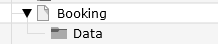
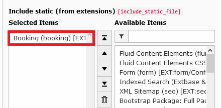
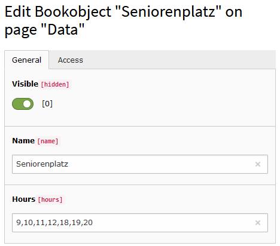

.. include:: ../Includes.txt

.. _installation:

============
Installation
============

Target group: **Administrators**

Import the extension from a local source or the TER like any other extension.

Create some pages as shown below.

On the page Booking insert the plugin Booking (Reservation) and limit the access to the plugin for logged in FE users.

On page 'Booking' or on your root page insert 'Typoscript Include static' (from extension) Booking (booking).
With the constant editor insert the desired settings of the extension like storage Pid, default calendar [week|month], jQuery options, path to templates etc.

On the page 'Data' (storagePid) insert at least one Booking object.
Insert a name and the operation hours of the object like "10,11,12,13,14,15,16".
The operation hours should be shown in green in the  Week Calendar.

When everything is done, log in as FE user and test the extension...

To use your own templates, copy the directory folder /typo3conf/ext/booking/Resources/ with
subdirectories to your own template folder (for example fileadmin/includes/ext/booking/Resources/).
Then change the templateRootPath in the constant editor to the new value of the template directory.

.. Hint:: Make sure, you have inserted the correct page id for "Default storage PID"!

Reference
^^^^^^^^^

.. _plugin-tx-booking:

plugin.tx\_booking.view
^^^^^^^^^^^^^^^^^^^^^^^

templateRootPath
""""""""""""""""

.. container:: table-row

   Property
         templateRootPath

   Data type
         string

   Description
         path to templates

   Default
         EXT:booking/Resources/Private/Templates/

partialRootPath
""""""""""""""""

.. container:: table-row

   Property
         partialRootPath

   Data type
         string

   Description
         path to partials

   Default
         EXT:booking/Resources/Private/Partials/
     
layoutRootPath
""""""""""""""

.. container:: table-row

   Property
         layoutRootPath

   Data type
         string

   Description
         path to layouts

   Default
         EXT:booking/Resources/Private/Layouts/

     
plugin.tx\_booking.persistance
^^^^^^^^^^^^^^^^^^^^^^^^^^^^^^ 

storagePid
""""""""""

.. container:: table-row

   Property
         storage page id

   Data type
         int

   Description
         page id of storage

   Default
         -

plugin.tx\_booking.settings
^^^^^^^^^^^^^^^^^^^^^^^^^^^

.. _defaultCalendar:

defaultCalendar
"""""""""""""""

.. container:: table-row

   Property
         The default calendar

   Data type
         string

   Description
         The default calendar when the plugin is shown [month|week]

   Default
         month

hoursToDisplay
""""""""""""""

.. container:: table-row

   Property
         The hours which are shown in calendar week

   Data type
         string

   Description
         The hours which are shown in week view

   Default
         7,8,9,10,11,12,13,14,15,16,17,18,19,20,21,22

		 

