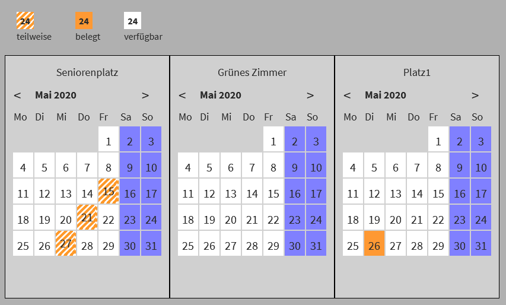
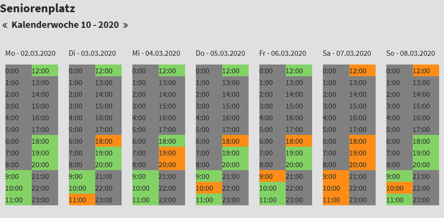
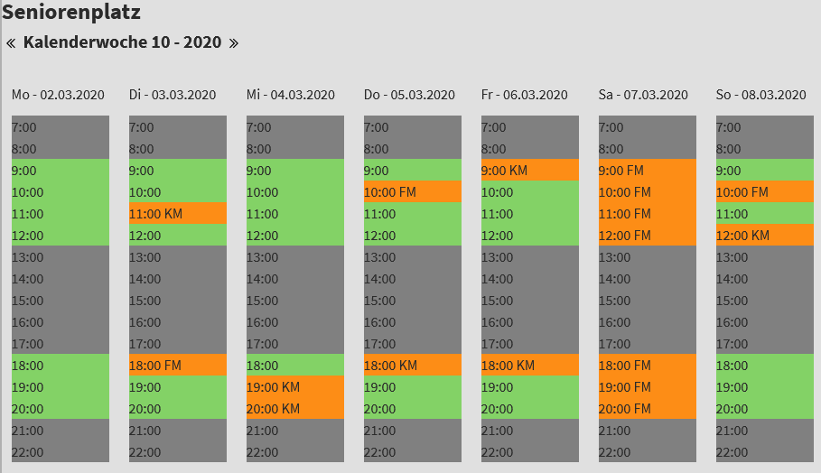
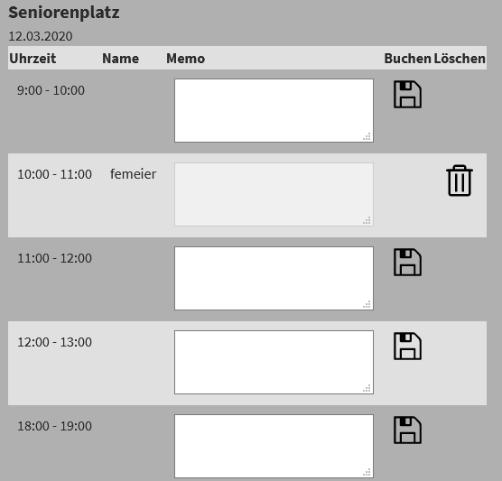


============
Introduction
============

.. ==================================================
.. FOR YOUR INFORMATION
.. --------------------------------------------------
.. -*- coding: utf-8 -*- with BOM.

.. include:: ../Includes.txt

.. _introduction:

What does it do?
================

The extension enables logged in FE Users to request an object for booking on a hourly base like rooms or similar. 

There are a month calendar views and a week calendar. With a click on a selected date in the calendar of the object, a booking form is shown.
In the booking form, you can book/request the desired hour if a booking icon is shown.
In this form you can delete your own request if a delete icon is shown.

The extension is configured with the constant editor of TYPO3. 

What's new?
^^^^^^^^^^^

Complete day bookings and day deletion implemented. 

Screenshots
^^^^^^^^^^^

**Month calendar** 

**Week calendar** 

**Booking form** 

