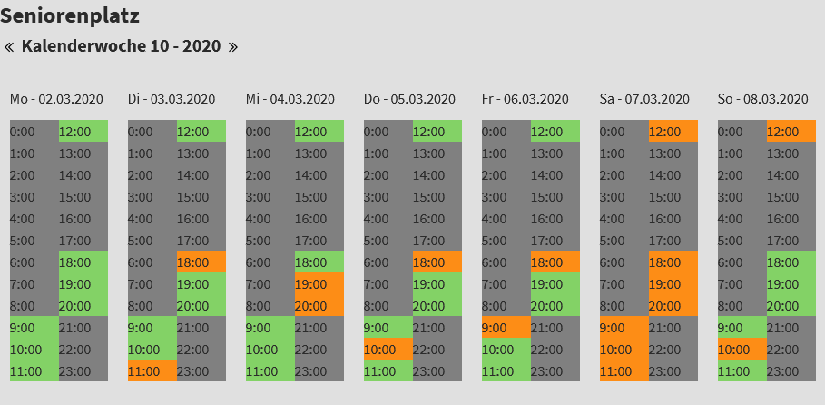

# Booking

#### Booking / reservation extension for TYPO3

What does it do
---------------

The extension shows calendars of booking objects.  FE users can book / make a reservation for an object on a hourly base.

#### Month calendar of booking objects

#### Week view

#### New Week view

#### Booking form

For details see [Introduction](https://github.com/joachimruhs/booking/blob/master/Documentation/Introduction/Index.rst "Introduction")

For configuration and installation in detail, see the [Administrator Manual](https://github.com/joachimruhs/booking/blob/master/Documentation/AdministratorManual/Index.rst "Administrator Manual")

